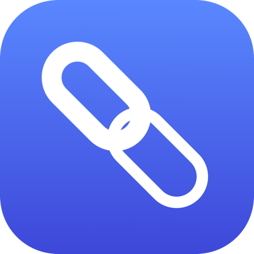

# LinkPaste



Slack's link-pasting behavior, everywhere on macOS.

Select some text, copy a URL, press **⌘V** — instead of replacing your selection with a raw URL, the selection becomes a hyperlink to it.

```
selection:  the documentation
clipboard:  https://example.com/docs
⌘V      →   the documentation      (linked to https://example.com/docs)
```

Slack, Notion, Jira and Bear each build this in. macOS doesn't provide it, so every other rich-text field on your Mac — Mail, Notes, Pages, TextEdit, Google Docs — makes you go the long way round. LinkPaste fills that gap system-wide.

## Install

Download `LinkPaste.zip` from [Releases](../../releases), unzip, and drag `LinkPaste.app` to `/Applications`.

On first launch it will ask for **Accessibility** access. It genuinely cannot work without this; seeing ⌘V and reading your selection both require it.

## How it works

1. A `CGEventTap` watches for ⌘V.
2. If the clipboard holds a URL and the front app isn't denylisted, the keystroke is swallowed.
3. The selected text is read via the Accessibility API, falling back to a synthetic ⌘C when the app won't report it (browsers, Slack, Notion).
4. The clipboard is temporarily replaced with rich text — `<a href="url">selection</a>` in RTF, HTML, and plain-text flavors. For apps marked as markdown composers in Settings, it's replaced with plain-text `[selection](url)` instead.
5. A synthetic ⌘V pastes it, then your original clipboard is restored.

**Every failure path falls back to an ordinary paste.** If anything is unclear, unsupported, or broken, you get the paste you would have gotten anyway.

## What counts as a URL

Anything with a scheme (`https://`, `mailto:`, `slack://`) plus bare domains with a recognized TLD (`example.com`, `sub.domain.co.uk/path`).

Deliberately *not* matched: anything containing whitespace, and filenames that happen to look like domains. `README.md`, `build.sh`, and `Version 2.0` are never turned into links — `.md`, `.sh` and friends are real TLDs, and linking them would be the most irritating possible false positive. See [`URLDetector.swift`](Sources/LinkPasteCore/URLDetector.swift).

## Where it doesn't run

Terminals, code editors, and password managers are excluded by default — they're plain-text surfaces where a rich paste is useless, and in the case of password managers, somewhere a synthetic ⌘C has no business going. Add your own in Settings by picking from your running apps or choosing an app on disk; the built-in exclusions are listed there too, so you can see what's already covered.

## Markdown composers

Some apps' rich-text field isn't actually rich text — Slack with **Format messages with markup** turned on, for instance, treats a paste as literal characters to type, not HTML to render. RTF/HTML pasted there doesn't degrade gracefully; it just doesn't link. There's no way for LinkPaste to detect that setting from outside the app, so it's opt-in: add an app under **Use markdown links in** in Settings, and pastes there switch to a plain-text `[selection](url)` instead of RTF/HTML. Nothing is pre-populated — this is off for every app until you turn it on.

Adding an app here also lifts it out of the denylist above, built-in or not — a plain-text editor like VS Code is excluded because RTF/HTML would dump garbage into it, but that reasoning doesn't apply once the output is markdown text. Marking an app as a markdown composer is treated as you deciding link-pasting belongs there.

## Settings

- **Enable link pasting** — global on/off.
- **Launch at login.**
- **⌘C fallback** — turn off if you'd rather no synthetic ⌘C is ever sent. Costs you support in browsers, Slack, and Notion.
- **Clipboard restore delay** (default 250 ms) — how long to wait before restoring your clipboard. No app signals when it has finished reading the pasteboard, so this is a timing guess. If a slow app ever pastes your *previous* clipboard instead of the link, raise it.
- **Never link-paste in these apps** — the denylist described above.
- **Use markdown links in** — the markdown-composer list described above.

## Build from source

```sh
swift build           # build
swift test            # 39 unit tests
scripts/make_app.sh   # assemble and ad-hoc sign dist/LinkPaste.app
```

Releases are cut locally:

```sh
scripts/release.sh 0.1.0
```

That tests, builds a universal binary, signs it with Developer ID, notarizes and staples it, tags, and publishes a GitHub release.

## Not on the Mac App Store

It can't be. Event taps and the Accessibility API are unavailable to sandboxed apps, and the App Store requires the sandbox. Developer ID distribution only.

## License

MIT
